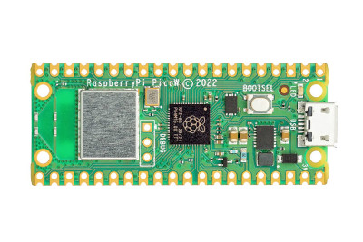
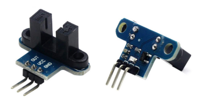
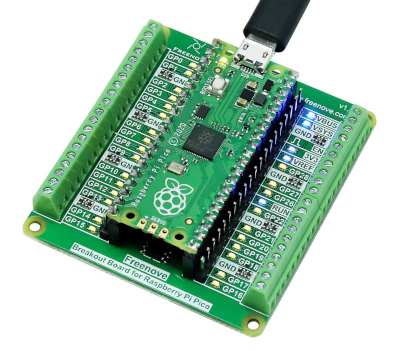
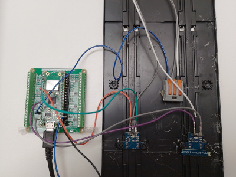
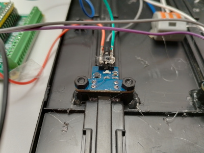

# _Smartrace Connect_ analog hardware interface
I like slot cars and I like [Smartrace](https://www.smartrace.de) :)

Smartrace together with the [Smartrace Connect](https://www.smartrace.de/en/analog/) plugin allows also analog tracks
to be used with the app. But, instead of using a phone and its camera to record lap times, I use a Raspberry Pi Pico W
to measure when a car passes through an IR sensor mounted in the slot.

## Necessary hardware
- [Raspberry Pi Pico W](https://datasheets.raspberrypi.com/picow/pico-w-product-brief.pdf?_gl=1*1lxaopt*_ga*Njg1NDkwMTE3LjE3MjUyMjI0ODk.*_ga_22FD70LWDS*MTcyNTIyMjUwOS4xLjAuMTcyNTIyMjUwOS4wLjAuMA..)



- IR sensors (one per lane)



- (optional) [Breakout board for Pico - I used one from freenove](https://store.freenove.com/products/fnk0081)



- Hot glue and spare cables


## Circuit diagram
The Raspberry Pico get its power from the USB port. You can supply the IR sensors from the Pin 36 (3V3_OUT)
and one of the GND Pins.

> [!WARNING]
> IR leds use more power than normal leds. I would avoid connecting more than
> 2 leds to the 3.3V output of the Raspberry Pico

The firmware expects the IR sensor to be active low: the output must go to ground when the car's guide
is passing through. In other words, the firmware is set to react to falling edges on the input pins.

The easier setup with 2 sensors used as finish line for 2 analog lanes is represented in the image below:


## Configuration
The communication between Smartrace and the Raspberry occurs via WiFi, therefor
the firmware needs to know the connection parameters to the network as well as the
IP address of the _Smartrace Connect_ server.

Rename the file `config_example.py` into `config.py` and insert
the correct values in the 3 sections.

- _WiFi parameters_:
SSID and password to access the WiFi network
```
config_wifi = {
        "SSID": "ssid",
        "password": "password",
    }
```

- _Smartrace connect parameters_:
IP address as well as port shown on the _Smartrace_ app
```
cconfig_smartrace = {
    "server": "198.166.144.28",
    "port": 50780,
}
```
- Hardware connections on Raspberry PI Pico: The hardware configuration if specified in the section

Important note: the parentheses are different from the one used in previous sections, [...] instead of {...}
```
config_hardware = [
    ...
]
```
fill _config_hardware_ with a lists of elements, where each element is included in (...) and
made of 3 parameters separated by commas
 ```
 (GPIO, lane_number, track_point)
 where
   GPIO: refer to Rasberry pinout, image circuit_diagram.png, it can be any light gree GPxx pin
   lane_number: an integer from 1 to 8 representing the controller in Smartrace
   track_point: what does it mean when a car is passing by.

the available options for track_point are:
FL   -> finish lane
PE   -> pit enter
PL   -> pit leave
FLPL -> finish line together with pit leave
```
check the file [config_example.py](./src/fw_pico_w/config_example.py), it is easier than it seems :)


> [!IMPORTANT]
> Be careful, do not use Pin 2 as imput for the IR sensor, refer to
> [Sudden disconnection](./Readme.md#Sudden-disconnection )
> below for more details

## Installing the firmware
Install the micropython firmware (at least version 1.23, due to the implementation
of collection.deque) following
[this guide](https://projects.raspberrypi.org/en/projects/getting-started-with-the-pico/3).

then install `mpremote` ( with `pip install mpremote`) to copy files onto the pi pico:

```
python -m mpremote fs cp main.py :
python -m mpremote fs cp config.py :
python -m mpremote fs cp smartrace_analog_hw.py :

cd uwebsockets
python -m mpremote fs mkdir :uwebsockets
python -m mpremote fs cp client.py :uwebsockets/
python -m mpremote fs cp protocol.py :uwebsockets/

cd ..
cd socketio
python -m mpremote fs mkdir :usocketio
python -m mpremote fs cp client.py :usocketio/
python -m mpremote fs cp protocol.py :usocketio/
python -m mpremote fs cp transport.py :usocketio/
```

## Known issues & workarounds
This chapter is used to collect known problems and possible solutions or workarounds.

### Sudden disconnection
The system suffers from sudden disconnections. I could not identify a clear pattern, so also finding a solution
is not that simple. It may be related to mycropython itself, to the driver of the wifi chip or to the websocket
library... it seems to happen also to other users, which is a little relief :)
Sometimes the transmission of a lap hangs. The firmware does not notice it, until it tries to send the
next recorded lap and if finds the resource occupied and crashes.
The firmware now recognises these events and keep tracks of the last 2 transferred laps, so not lap is lost.
But this issue has a wider impact.
- Case 1: the firmware re-establishes the websocket connection, but Smartrace pauses the
race, and does not record the 2 laps because the race was stopped.
- Case 2: the firmware resets the wifi and keep pushing lap times (including the two lost). Smartrace notifies the
loss of sensor but accepts the new times.

The firmware implements Case 2, but it introduces the next issue :( until the firmware re-establishes the
websocket connection Smartrace does not accept a "Start race" command. The easiest solution is power off and power
on the chip again.

Workaround: the firmware checks if the GPIO 2 is put to ground for circa 1s while the software states registered a
wifi disconnection. In that case it forces a new websocket connection.
In conclusion, do not configure GPIO 2 for IR sensors and install a simple push button between GPIO 2 and GND.


### No failsafe in case of wrong configuration file
TODO

## Smartrace Websocket Protocol
If you are interested to understand how it works under the hood have a look at the
[protocol page](./doc/protocol.md)

## List of full sized images
see [list_of_images.md](./doc/list_of_images.md)


## Fotos of the prototype


